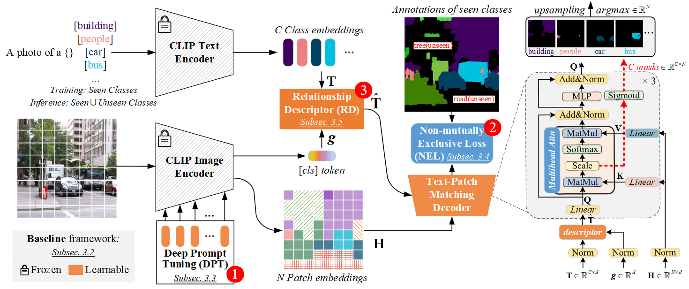

# ZegCLIP: Towards Adapting CLIP for Zero-shot Semantic Segmentation

Authors: Ziqin Zhou, Yinjie Lei, Bowen Zhang, Lingqiao Liu*, Yifan Liu.     *Corresponding author

[[paper](https://arxiv.org/abs/2212.03588)] [[github](https://github.com/ZiqinZhou66/ZegCLIP)] [[docker image](https://hub.docker.com/repository/docker/ziqinzhou/zegclip/general)] [[pretrained models](https://github.com/ZiqinZhou66/ZegCLIP/tree/main#pretrained-models)] [[visualization](https://github.com/ZiqinZhou66/ZegCLIP/blob/main/figs/vis.png)]  [[visualization of class queries](https://github.com/ZiqinZhou66/ZegCLIP/blob/main/figs/vis-query.png)]

---

> **Abstract:** *Recently, CLIP has been applied to pixel-level zero-shot learning tasks via a two-stage scheme. The general idea is to first generate class-agnostic region proposals and then feed the cropped proposal regions to CLIP to utilize its image-level zero-shot classification capability. While effective, such a scheme requires two image encoders, one for proposal generation and one for CLIP, leading to a complicated pipeline and high computational cost. In this work, we pursue a simpler-and-efficient one-stage solution that directly extends CLIP's zero-shot prediction capability from image to pixel level. Our investigation starts with a straightforward extension as our baseline that generates semantic masks by comparing the similarity between text and patch embeddings extracted from CLIP. However, such a paradigm could heavily overfit the seen classes and fail to generalize to unseen classes. To handle this issue, we propose three simple-but-effective designs and figure out that they can significantly retain the inherent zero-shot capacity of CLIP and improve pixel-level generalization ability. Incorporating those modifications leads to an efficient zero-shot semantic segmentation system called ZegCLIP. Through extensive experiments on three public benchmarks, ZegCLIP demonstrates superior performance, outperforming the state-of-the-art methods by a large margin under both ''inductive'' and ''transductive'' zero-shot settings. In addition, compared with the two-stage method, our one-stage ZegCLIP achieves a speedup of about 5 times faster during inference.* 
>
> <p align="center">
> 
> </p>


## Environment:

Option 1:

- Install pytorch

 `conda install pytorch==1.10.1 torchvision==0.11.2 torchaudio=0.10.1 cudatoolkit=10.2 -c pytorch`

- Install the mmsegmentation library and some required packages.

 `pip install mmcv-full==1.4.4 mmsegmentation==0.24.0`
 `pip install scipy timm==0.3.2`

Option 2:

- Directly apply the same Image we provieded in Dockerhub:

 `docker push ziqinzhou/zegclip:latest`

## Downloading and preprocessing Dataset:
According to MMseg: https://github.com/open-mmlab/mmsegmentation/blob/master/docs/en/dataset_prepare.md

## Preparing Pretrained CLIP model:
Download the pretrained model here: Path/to/ViT-B-16.pt
https://openaipublic.azureedge.net/clip/models/5806e77cd80f8b59890b7e101eabd078d9fb84e6937f9e85e4ecb61988df416f/ViT-B-16.pt

## Pretrained models:

|     Dataset     |   Setting    |  pAcc | mIoU(S) | mIoU(U) | hIoU |                           Model Zoo                           |
| :-------------: | :---------:  | :---: | :-----: | :-----: | :--: |  :----------------------------------------------------------: |
| PASCAL VOC 2012 |  Inductive   |  94.6 |   91.9  |   77.8  | 84.3 | [[Google Drive](https://drive.google.com/file/d/1MqIFntWtTQk3HPiZp8hysI7CQIDTXteS/view?usp=share_link)] |
| PASCAL VOC 2012 | Transductive |  96.2 |   92.3  |   89.9  | 91.1 | [[Google Drive](https://drive.google.com/file/d/1PsXOd_A9Pww3ftclTDVWKcAvNIOAn6E-/view?usp=share_link)] |
| PASCAL VOC 2012 |    Fully     |  96.3 |   92.4  |   90.9  | 91.6 | [[Google Drive](https://drive.google.com/file/d/1oBj2FRV17TAKKrSexg4SUKa4I0egEwaj/view?usp=sharing)] |
| COCO Stuff 164K |  Inductive   |  62.0 |   40.2  |   41.1  | 40.8 | [[Google Drive](https://drive.google.com/file/d/12M6T97o9wyxbJKrR7zLfFMDsGVTiq4WY/view?usp=share_link)]|
| COCO Stuff 164K | Transductive |  69.2 |   40.7  |   59.9  | 48.5 | [[Google Drive](https://drive.google.com/file/d/1S8ia0-0oAUELxQXWqz0OlKoEv68gUuMp/view?usp=sharing)]|
| COCO Stuff 164K |    Fully     |  69.9 |   40.7  |   63.2  | 49.6 | [[Google Drive](https://drive.google.com/file/d/1DvUpYZa0rtPUBOjsYWwt-TEs6YdvUG0C/view?usp=share_link)] |

Note that here we report the averaged results of several training models and provide one of them.

## Efficiency results:
|     Dataset     |  #Params(M) |  Flops(G)  |     FPS    |
| :-------------: | :---------: | :--------: | :--------: |
| PASCAL VOC 2012 |    13.8     |    110.4   |     9.0    |
| COCO Stuff 164K |    14.6     |    123.9   |     6.7    |

Note that all experience are conducted on a single 1080Ti GPU and #Params(M) represents the number of learnable parameters.

## Training (Inductive):

 ```shell
 bash dist_train.sh configs/coco/vpt_seg_zero_vit-b_512x512_80k_12_100_multi.py Path/to/coco/zero_12_100
 bash dist_train.sh configs/voc12/vpt_seg_zero_vit-b_512x512_20k_12_10.py Path/to/voc12/zero_12_10
 ```

## Training (Transductive):
 ```shell
 bash dist_train.sh ./configs/coco/vpt_seg_zero_vit-b_512x512_40k_12_100_multi_st.py Path/to/coco/zero_12_100_st --load-from=Path/to/coco/zero_12_100/iter_40000.pth
 bash dist_train.sh ./configs/voc12/vpt_seg_zero_vit-b_512x512_10k_12_10_st.py Path/to/voc12/zero_12_10_st --load-from=Path/to/voc12/zero_12_10/iter_10000.pth
 ```

## Training (Fully supervised):
 ```shell
 bash dist_train.sh configs/coco/vpt_seg_fully_vit-b_512x512_80k_12_100_multi.py Path/to/coco/fully_12_100
 bash dist_train.sh configs/voc12/vpt_seg_fully_vit-b_512x512_20k_12_10.py Path/to/voc12/fully_12_10
 ```

## Inference:
 `python test.py ./path/to/config ./path/to/model.pth --eval=mIoU`

For example: 
```shell
CUDA_VISIBLE_DEVICES="0" python test.py configs/coco/vpt_seg_zero_vit-b_512x512_80k_12_100_multi.py Path/to/coco/zero_12_100/latest.pth --eval=mIoU
```

## Cross Dataset Inference:
```shell
CUDA_VISIBLE_DEVICES="0" python test.py ./configs/cross_dataset/coco-to-voc.py Path/to/coco/vpt_seg_zero_80k_12_100_multi/iter_80000.pth --eval=mIoU
CUDA_VISIBLE_DEVICES="0" python test.py ./configs/cross_dataset/coco-to-context.py Path/to/coco/vpt_seg_zero_80k_12_100_multi/iter_80000.pth --eval=mIoU
```

## Related Assets \& Acknowledgement

Our work is closely related to the following assets that inspire our implementation. We gratefully thank the authors. 

 - CLIP:  https://github.com/openai/CLIP
 - Maskformer: https://bowenc0221.github.io/maskformer
 - Zegformer: https://github.com/dingjiansw101/ZegFormer
 - zsseg: https://github.com/MendelXu/zsseg.baseline
 - MaskCLIP: https://github.com/chongzhou96/MaskCLIP
 - SegViT: https://github.com/zbwxp/SegVit
 - DenseCLIP: https://github.com/raoyongming/DenseCLIP/blob/master/segmentation/denseclip
 - Visual Prompt Tuning: https://github.com/KMnP/vpt
 
## Citation:
If you find this project useful, please consider citing:
```
@article{zhou2022zegclip,
  title={ZegCLIP: Towards adapting CLIP for zero-shot semantic segmentation},
  author={Zhou, Ziqin and Lei, Yinjie and Zhang, Bowen and Liu, Lingqiao and Liu, Yifan},
  journal={Proceedings of the IEEE/CVF Conference on Computer Vision and Pattern Recognition (CVPR)},
  year={2023}
}
```
